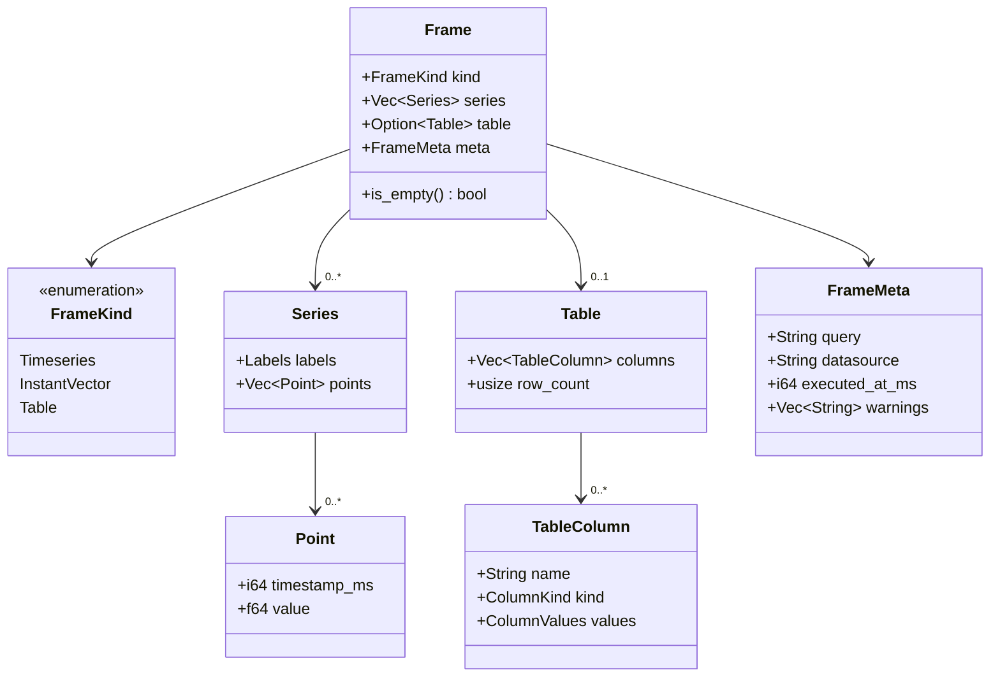

# dash9 — SPEC.md

`dash9` is a terminal UI for observability dashboards: panels run
queries against datasources and render as charts in the terminal.
Dashboards are TOML files that are testable in CI.

This document is the single source of truth for Phase 1 (v0.1). Every
capability is defined in exactly one place below and cross-referenced
elsewhere. No implementation code is written until this document is
internally consistent and approved.

## Contents

- [A. The Frame model](#a-the-frame-model)
- [B. The command grammar](#b-the-command-grammar)
- [C. The dashboard TOML schema](#c-the-dashboard-toml-schema)
- [D. Non-goals for v0.1](#d-non-goals-for-v01)

---

## A. The Frame model

The `Frame` is the single internal data type every datasource adapter
produces and every renderer consumes. Nothing downstream of a `Frame`
knows which datasource produced it — a `dash9-tui` chart widget, the
`dash9 test` runner, and (later) an LLM adapter all operate on the same
type regardless of whether the data came from Prometheus or something
else added afterward. This crate (`dash9-core`) owns the type; adapters
(`dash9-prom`, etc.) normalize at their boundary and never leak their
native response shapes past it.

### A.1 Shape

A `Frame` has one of three kinds. All three share the same envelope
(`FrameMeta`) so error/empty handling is uniform across kinds.



```rust
pub struct Frame {
    pub kind: FrameKind,
    /// Populated when kind is Timeseries or InstantVector. Empty otherwise.
    pub series: Vec<Series>,
    /// Populated when kind is Table. None otherwise.
    pub table: Option<Table>,
    pub meta: FrameMeta,
}

pub enum FrameKind {
    Timeseries,
    InstantVector,
    Table,
}

pub struct Series {
    pub labels: Labels,
    pub points: Vec<Point>,
}

pub struct Point {
    pub timestamp_ms: i64, // Unix epoch milliseconds, UTC
    pub value: f64,
}

pub type Labels = std::collections::BTreeMap<String, String>;

pub struct Table {
    pub columns: Vec<TableColumn>,
    pub row_count: usize,
}

pub struct TableColumn {
    pub name: String,
    pub kind: ColumnKind,
    pub values: ColumnValues,
}

pub enum ColumnKind {
    Time,
    Float,
    Int,
    String,
    Bool,
}

/// One variant per ColumnKind. Every column's Vec has exactly
/// `Table::row_count` entries. Non-time columns carry `Option<T>` so a
/// table can represent SQL-style NULL; the Time column never has gaps.
pub enum ColumnValues {
    Time(Vec<i64>),
    Float(Vec<Option<f64>>),
    Int(Vec<Option<i64>>),
    String(Vec<Option<String>>),
    Bool(Vec<Option<bool>>),
}

pub struct FrameMeta {
    /// The query text as sent to the datasource, verbatim. Used in
    /// error messages and `dash9 test` failure reports.
    pub query: String,
    /// The datasource name (matches a `[[datasources]]` entry, see
    /// Section C), not the datasource type.
    pub datasource: String,
    pub executed_at_ms: i64,
    /// Non-fatal adapter warnings (e.g. "series limit truncated
    /// results"). Never populated with fatal errors — those are
    /// `Err(...)`, not a `Frame` with warnings.
    pub warnings: Vec<String>,
}
```

`Labels` is a `BTreeMap` (not `HashMap`) so label sets serialize and
compare deterministically — this matters for `dash9 test` fixture
diffs and for any future LLM tooling that reads command output.

### A.2 Kind semantics

**Timeseries** — zero or more `Series`, each with its own label set and
its own list of `(timestamp_ms, value)` points. Series are **not**
forced onto a shared time grid: Prometheus range-vector series can have
gaps or slightly different sample timestamps, and forcing alignment
would require gap-filling policy that belongs in the renderer, not the
data model. A renderer draws each series independently.

**InstantVector** — structurally identical to `Timeseries` (`Vec<Series>`
of labeled points). By convention every `Series` in an `InstantVector`
frame has exactly one `Point`, all sharing the same `timestamp_ms` (the
query evaluation time). This is a producer convention, not a type-level
invariant — `dash9-core` does not reject a multi-point series in an
`InstantVector` frame, but adapters must not produce one, and `dash9
test` validation (Section C) treats a violation as a datasource bug,
not a schema error.

**Table** — column-oriented, arbitrary schema. Used for anything that
isn't naturally a labeled time series (e.g. a Prometheus instant query
rendered as a flat table, or a future SQL-like datasource).

### A.3 Timestamps

All timestamps inside `dash9-core` and everything downstream of it are
`i64` Unix epoch **milliseconds, UTC**. This is non-negotiable at the
`Frame` boundary: an adapter that receives Prometheus's fractional
Unix-seconds floats (e.g. `1700000000.123`) converts to `i64` millis
*before* constructing the `Frame`. No timezone-aware type crosses the
boundary — local-time display, if ever added, is a renderer-only
concern applied at the last possible moment.

### A.4 Empty results

There is exactly one definition of "empty," implemented as
`Frame::is_empty(&self) -> bool`, and every caller (the TUI's "no data"
placeholder, `dash9 test`'s `allow_empty` check in Section C) uses it
rather than re-deriving emptiness:

```rust
impl Frame {
    pub fn is_empty(&self) -> bool {
        match self.kind {
            FrameKind::Timeseries | FrameKind::InstantVector => {
                self.series.is_empty() || self.series.iter().all(|s| s.points.is_empty())
            }
            FrameKind::Table => self.table.as_ref().is_none_or(|t| t.row_count == 0),
        }
    }
}
```

Note the two distinct ways a timeseries/instant-vector frame can be
empty — no series matched at all (`series: vec![]`), or series matched
but none had points in range (every `Series.points` is empty) — both
count as empty. `dash9-prom` must not synthesize placeholder series to
paper over either case.

A `Frame` is never `None`/absent to represent "no data." A failed query
(datasource unreachable, query doesn't parse, etc.) is a `Result::Err`
at the adapter trait boundary (Section C.3), never an empty `Frame`.
An empty `Frame` unambiguously means "the query executed successfully
and matched nothing."

### A.5 Worked examples

Timeseries frame, two series, JSON serialization (serde, for fixture
files used in `dash9-prom` integration tests):

```json
{
  "kind": "timeseries",
  "series": [
    {
      "labels": { "instance": "10.0.0.1:9100", "job": "node" },
      "points": [
        { "timestamp_ms": 1700000000000, "value": 0.42 },
        { "timestamp_ms": 1700000015000, "value": 0.47 }
      ]
    },
    {
      "labels": { "instance": "10.0.0.2:9100", "job": "node" },
      "points": [
        { "timestamp_ms": 1700000000000, "value": 0.11 },
        { "timestamp_ms": 1700000015000, "value": 0.13 }
      ]
    }
  ],
  "table": null,
  "meta": {
    "query": "rate(node_cpu_seconds_total[5m])",
    "datasource": "prom",
    "executed_at_ms": 1700000015421,
    "warnings": []
  }
}
```

Instant vector frame, one point per series:

```json
{
  "kind": "instant_vector",
  "series": [
    {
      "labels": { "instance": "10.0.0.1:9100", "job": "node" },
      "points": [{ "timestamp_ms": 1700000015000, "value": 0.47 }]
    }
  ],
  "table": null,
  "meta": {
    "query": "node_load1",
    "datasource": "prom",
    "executed_at_ms": 1700000015421,
    "warnings": []
  }
}
```

Table frame:

```json
{
  "kind": "table",
  "series": [],
  "table": {
    "columns": [
      { "name": "instance", "kind": "string", "values": { "String": ["10.0.0.1:9100", "10.0.0.2:9100"] } },
      { "name": "load1", "kind": "float", "values": { "Float": [0.47, 0.13] } }
    ],
    "row_count": 2
  },
  "meta": {
    "query": "node_load1",
    "datasource": "prom",
    "executed_at_ms": 1700000015421,
    "warnings": []
  }
}
```

Empty frame (query executed, matched nothing):

```json
{
  "kind": "timeseries",
  "series": [],
  "table": null,
  "meta": {
    "query": "rate(nonexistent_metric[5m])",
    "datasource": "prom",
    "executed_at_ms": 1700000015421,
    "warnings": []
  }
}
```

---

## B. The command grammar

One command language is consumed by four surfaces: TUI keybindings,
the interactive command bar, dashboard TOML files (Section C), and the
headless `dash9 test` runner. A later LLM adapter (out of scope for
this phase, see Section D) will also emit this grammar rather than a
bespoke API, which is why every error carries a stable machine-readable
code, not just a message.

### B.1 Versioning rule

**The grammar is append-only starting at v0.1.** Once a verb ships with
a given arity and semantics, that arity and semantics never change.
Extending a capability means adding a new verb (or new subverb) — e.g.
if `panel threshold` ever needs a fourth argument, it ships as a new
subverb rather than changing `panel threshold`'s existing meaning. This
guarantees dashboard TOML files, saved keybindings, and anything an
LLM has previously learned to emit remain valid forever. Value-level
grammars nested inside an argument (e.g. the duration syntax in B.4)
may still grow to accept more input in later versions, since that is
strictly a superset — old-format values remain valid.

### B.2 Lexical grammar

```
command        = ws* verb (ws+ arg)* ws* ;
verb           = namespaced-verb | flat-verb ;
namespaced-verb= ns ws+ subverb ;
ns             = "ds" | "panel" | "dash" ;
subverb        = ident ;
flat-verb      = "q" | "range" | "refresh" | "quit" ;
arg            = quoted-string | bare-word ;
quoted-string  = '"' ( escape | [^"\\] )* '"' ;
escape         = '\\' ( '"' | '\\' | 'n' | 't' ) ;
bare-word      = [^ \t"]+ ;
ws             = ' ' | '\t' ;
```

One command per line; there is no multi-command separator and no
comment syntax in v0.1. Whitespace runs collapse — `ds   add  prom`
tokenizes identically to `ds add prom`.

**Special case — `q` is raw-tail, not tokenized.** Query languages
(PromQL today, others later) use their own double-quote syntax for
label matchers, e.g. `up{job="api"}`. Running that through the general
tokenizer above would collide with our quoting rules. So `q` is
special-cased: its single argument is *everything after the first
run of whitespace following `q`*, taken verbatim, with no quote
stripping and no escape processing. `dash9-core`'s parser does not
look inside it; the query text is handed to the datasource adapter
unmodified. Every other verb uses the tokenized grammar above.

### B.3 Verb reference

| Verb | Args | Arity | Example |
|---|---|---|---|
| `ds add` | `<name> <type> <url>` | 3 | `ds add prom prometheus http://localhost:9090` |
| `ds list` | — | 0 | `ds list` |
| `ds metrics` | `[name]` | 0 or 1 | `ds metrics prom` |
| `ds metric` | `<name> [ds_name]` | 1 or 2 | `ds metric up prom` |
| `q` | `<query>` (raw-tail, see B.2) | 1 | `q up{job="api"}` |
| `panel type` | `<type>` | 1 | `panel type gauge` |
| `panel threshold` | `<name> <op> <value>` | 3 | `panel threshold crit gte 95` |
| `panel title` | `<text>` | 1 | `panel title "CPU Usage"` |
| `range` | `<duration>` | 1 | `range 1h` |
| `refresh` | `<duration \| "off">` | 1 | `refresh 30s` |
| `dash save` | `<path>` | 1 | `dash save examples/demo.toml` |
| `dash open` | `<path>` | 1 | `dash open examples/demo.toml` |
| `quit` | — | 0 | `quit` |

Valid values for `panel type` and the operators accepted by
`panel threshold` are defined once, in Section C.1 (`panel.type`) and
Section C.2 (`threshold.op`), since those are dashboard-schema
concepts that the command grammar merely mutates at runtime — this
document does not redefine them here.

`panel type`, `panel threshold`, and `panel title` act on the
currently focused panel in the TUI. In a headless context (`dash9
test`, or a scripted command file with no panel focus) issuing any
`panel *` verb with no panel focused is a validation error (`E103`,
Section B.5) — these three verbs are not meaningful outside a session
with panel focus.

### B.4 Duration values

Several arguments (`range`, `refresh`, `[dashboard].refresh`,
`[dashboard].default_range`, and `test_latency_budget` in Section C)
share one duration grammar, defined here once:

```
duration = digits unit ;
digits   = [0-9]+ ;
unit     = "s" | "m" | "h" | "d" ;
```

Examples: `30s`, `5m`, `1h`, `2d`. v0.1 supports exactly one
integer-magnitude, one-unit values — no compound durations like
`1h30m` and no fractional magnitudes. This is a value-grammar
restriction, not a verb, so per B.1 it may be relaxed later to accept
compound forms without breaking any file that only ever used the
single-unit form. `refresh` additionally accepts the literal `off` to
disable auto-refresh.

### B.5 Error semantics

Every parse or validation failure is a `CommandError`:

```rust
pub struct CommandError {
    pub code: ErrorCode,
    pub message: String,           // human-readable, includes offending token
    pub span: Option<(usize, usize)>, // byte offsets into the input line, if applicable
}
```

Codes are stable for the lifetime of the grammar (append-only, same as
verbs — a code is never repurposed). Parse-level codes are produced by
tokenizing/structural checks alone, before any runtime state is
consulted; validation-level codes require runtime state (known
datasources, focused panel, filesystem).

| Code | Meaning |
|---|---|
| `E001` | Empty command (blank or whitespace-only line) |
| `E002` | Unknown verb (first token matches no flat-verb or namespace) |
| `E003` | Unknown subverb (namespace recognized, second token isn't) |
| `E004` | Unterminated quoted string |
| `E005` | Arity mismatch — wrong number of arguments |
| `E006` | Argument fails value-level validation (bad duration, bad enum value, non-numeric threshold) |
| `E101` | Unknown datasource reference |
| `E102` | Duplicate datasource name in `ds add` |
| `E103` | `panel *` verb issued with no panel focused |
| `E104` | `dash open` path does not exist or is not readable |
| `E105` | `dash save` path is not writable |
| `E106` | Query execution failed (wraps the datasource adapter's error) |
| `E107` | `dash save`/`dash open` path resolves outside the workspace root (absolute path, `..` traversal, or a symlink escape) |

`E106` is deliberately the only code that wraps an adapter-specific
error rather than describing the grammar itself — a malformed PromQL
expression inside a raw-tail `q` argument is invisible to the parser
(B.2) and only surfaces when the adapter tries to execute it.

`E107` was added after v0.1 shipped (`docs/specs/assist.md` Section
C.2), append-only per B.1/B.5 — it does not change any existing code's
meaning. The same workspace-relative-path check also guards the
interactive session's `/save` and `/record` destinations
(`docs/specs/open.md` Sections I, J).

Worked examples:

```
> xyz foo
E002: unknown verb "xyz"

> ds add prom
E005: "ds add" expects 3 arguments (name, type, url), got 1

> panel type pie
E006: "pie" is not a valid panel type (expected: timeseries, gauge, table, stat)

> ds frobnicate prom
E003: unknown subverb "frobnicate" for namespace "ds"

> q up{job="api"
(parses fine — E106 only if/when the adapter rejects the PromQL at execution time)
```

---

## C. The dashboard TOML schema

A dashboard is one TOML file: metadata, a list of datasources, and a
list of panels. The CLI's `dash9 open <path>` loads one into an
interactive session (`docs/specs/open.md`); once inside that session,
the grammar's `dash save <path>`/`dash open <path>` verbs (B.3) write
the current in-session state back out or replace the session with a
different file. `dash9 test <path>` validates a file headlessly (C.3)
without opening a session at all.

### C.1 Schema reference

```
[dashboard]
title                 : string                  (required)
refresh               : duration | "off"        (required; see B.4)
default_range         : duration                (required; see B.4)
test_latency_budget   : duration                 (optional; default "5s"; see C.3)

[[datasources]]
name                  : string, unique           (required)
type                  : "prometheus"             (required; only value in v0.1)
url                   : string (URL)             (required)

[[panels]]
title                 : string                   (required)
type                  : "timeseries" | "gauge" | "table" | "stat"   (required)
datasource            : string, must match a [[datasources]].name   (required)
query                 : string, opaque to dash9-core (raw-tail, same as command grammar's `q`; see B.2) (required)
allow_empty           : bool                     (optional; default false; see C.3)
latency_budget        : duration                 (optional; overrides [dashboard].test_latency_budget for this panel; see C.3)
grid.row              : integer >= 0             (required)
grid.col              : integer >= 0             (required)
grid.w                : integer >= 1             (required)
grid.h                : integer >= 1             (required)

[[panels.thresholds]]      (zero or more per panel)
name                  : string                   (required)
op                    : "gt" | "gte" | "lt" | "lte"   (required)
value                 : float                    (required)
```

**`panel.type`** is the single canonical definition of the four
visualization kinds; the `panel type` command (Section B.3) sets this
same field at runtime and accepts no other values.

**`threshold.op`** is the single canonical definition of threshold
comparison operators; the `panel threshold` command (Section B.3) sets
`name`/`op`/`value` on the focused panel's threshold list using this
same enum.

**Grid layout** is a plain integer grid: `row`/`col` place a panel's
top-left corner, `w`/`h` give its span, in grid units. v0.1 fixes the
grid to 12 columns (`col + w <= 12` is a validation error); row count
is unbounded. v0.1 does **not** validate that panels don't overlap —
that is deliberately deferred, not an oversight (Section D lists it
under things not implemented).

### C.2 Worked example

```toml
[dashboard]
title = "Node Overview"
refresh = "30s"
default_range = "1h"
test_latency_budget = "5s"

[[datasources]]
name = "prom"
type = "prometheus"
url = "http://localhost:9090"

[[panels]]
title = "CPU Usage"
type = "timeseries"
datasource = "prom"
query = "rate(node_cpu_seconds_total{mode=\"user\"}[5m])"
grid = { row = 0, col = 0, w = 6, h = 4 }

[[panels.thresholds]]
name = "warn"
op = "gte"
value = 0.75

[[panels.thresholds]]
name = "crit"
op = "gte"
value = 0.90

[[panels]]
title = "Load Average (1m)"
type = "stat"
datasource = "prom"
query = "node_load1"
grid = { row = 0, col = 6, w = 3, h = 4 }

[[panels]]
title = "Disk Free %"
type = "gauge"
datasource = "prom"
query = "node_filesystem_avail_bytes{mountpoint=\"/\"} / node_filesystem_size_bytes{mountpoint=\"/\"} * 100"
grid = { row = 0, col = 9, w = 3, h = 4 }

[[panels]]
title = "Top Processes by CPU"
type = "table"
datasource = "prom"
query = "topk(5, rate(process_cpu_seconds_total[5m]))"
allow_empty = true
grid = { row = 4, col = 0, w = 12, h = 4 }
```

### C.3 `dash9 test` semantics

`dash9 test <dashboard.toml>` is headless and CI-usable. It:

1. Loads and validates the TOML file itself. A structural/schema error
   here (unknown field, wrong type, `col + w > 12`, duplicate
   datasource name, a panel's `datasource` referencing an undefined
   name, etc.) is reported with the same error codes as Section B.5
   where they overlap semantically (e.g. duplicate datasource name is
   still `E102`) and the process exits **2** without running any
   query.
2. For each panel, in file order, against its referenced datasource:
   - **(a) Parses/executes.** The query is sent to the datasource
     adapter. A parse or execution failure is reported as `E106`
     (Section B.5) for that panel and counts as a failure.
   - **(b) Non-empty, unless excused.** The returned `Frame`'s
     `is_empty()` (Section A.4) must be `false`, unless the panel sets
     `allow_empty = true`, in which case an empty result is a pass.
   - **(c) Latency budget.** Wall-clock query time must be under the
     panel's `latency_budget` if set, else `[dashboard]
     .test_latency_budget`, else the default `5s`. Exceeding it is a
     failure for that panel even if (a) and (b) passed.
3. Prints one PASS/FAIL line per panel and a summary.

**Exit codes:** `0` if every panel passes all three checks; `1` if the
file was valid but one or more panels failed (a), (b), or (c); `2` if
the dashboard file itself failed to load/validate and no panel was
attempted. This distinction lets CI tell "your dashboard file is
broken" apart from "your dashboard file is fine but the query
regressed."

---

## D. Non-goals for v0.1

Explicitly out of scope, so they are not accidentally implemented
during Phase 1:

- **No LLM adapter.** The command grammar (Section B) is designed so
  one can be added later as an optional adapter that emits the same
  commands everything else emits, but no LLM code, prompt, or
  repair-loop logic exists in this phase.
- **No Grafana JSON dashboard import or export.** The only dashboard
  format is the TOML schema in Section C.
- **No datasources beyond Prometheus.** No Loki, no ClickHouse, no SQL,
  no anything else. `type = "prometheus"` is the only accepted
  `[[datasources]]` type.
- **No alerting.** No alert rules, no notification channels, no
  silences, no threshold-triggered actions — thresholds (Section C.1)
  are purely a rendering/color concern, not an evaluation engine.
- **No auth.** No login, no credential storage beyond a bare
  datasource URL, no TLS client certs, no multi-user support, no RBAC.
- **No query templating/variables.** No `$variable`-style substitution
  in queries; every `query` string in Section C.1 is used verbatim.
- **No panel overlap validation** in the grid layout (Section C.1) —
  panels may be positioned to visually collide and `dash9 test` will
  not catch it.
- **No persistence beyond the TOML file on disk.** No database, no
  server mode, no remote dashboard sharing.
