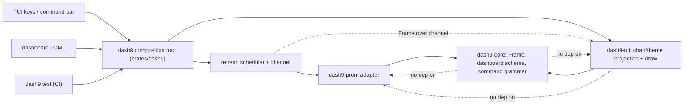
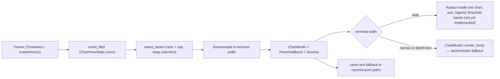

# Rendering architecture

dash9 follows the same rendering architecture as
[LoreMesh](https://github.com/Ritevista/loremesh) (see its
`docs/architecture/code-structure-and-rendering.md`): presentation
models that know no widgets, a one-way projection pipeline with
validation at every boundary, a deterministic text fallback for every
panel, a semantic theme where color is never load-bearing, pure
renderers, and a crate graph that only points inward. This document is
the dash9-specific instance of that architecture — the current
implementation, not a catalogue of hypothetical subsystems — plus the
places dash9 deliberately diverges from LoreMesh and why.

## Review map

| Path | Review responsibility | Primary boundary to verify |
|---|---|---|
| `crates/dash9-core/src/frame.rs` | Canonical `Frame`/`Series`/`Point`/`Table` model and the single `Frame::is_empty()` definition | No UI, terminal, or vendor dependency; timestamps are `i64` UTC millis only |
| `crates/dash9-core/src/dashboard.rs` | Dashboard TOML schema, loader, and `ValidatedDashboard`/`ValidatedPanel`/`ValidatedThreshold` | Parses/validates only; no rendering or terminal decision |
| `crates/dash9-core/src/command.rs` | The one command grammar consumed by TUI keys, the command bar, dashboard TOML, and `dash9 test` | Tokenizes/parses only; never panics (`parse_never_panics` proptest) |
| `crates/dash9-core/src/duration.rs`, `error.rs` | Shared duration grammar and stable, append-only error codes | No presentation formatting (e.g. no locale/timezone conversion) |
| `crates/dash9-tui/src/chart.rs` | `ChartModel`, `ChartSeries`, `ThresholdBand`, `Severity`, downsampling, and the deterministic text fallback | No Ratatui import; constructible and assertable with no terminal (Mechanism 1) |
| `crates/dash9-tui/src/theme.rs` | Semantic color roles, the stable series palette, and `Severity` → `Color` mapping | Contains no data/business logic; the only module allowed to name a `ratatui::style::Color` |
| `crates/dash9-tui/src/lib.rs` | Future Ratatui draw code, panel grid layout, input handling | Reads only `ChartModel`/theme output; no filesystem, network, or datasource access |
| `crates/dash9-prom/src/lib.rs` | Prometheus adapter; normalizes HTTP responses to `Frame` at the boundary | Never leaks a native response shape past `Frame`; converts Prometheus's fractional-seconds floats to `i64` millis before constructing `Frame` |
| `crates/dash9/src/main.rs` | CLI and composition root: `open`/`test`/`demo`; owns the refresh scheduler and delivers `Frame`s to the TUI over a channel | Concrete adapters, async runtime, and cross-crate conversions stay here; the only place `dash9-tui` and `dash9-prom` meet |

## Dependency boundary

The crate graph points inward. `dash9-tui` depends on `dash9-core` and
never on `dash9-prom`; `dash9-core` has no Ratatui, tokio, or HTTP
dependency at all. `scripts/check-architecture.sh` enforces both
edges mechanically (grep-based dependency-manifest checks), not just
by review.



Review rule: domain policy (grammar, schema, `Frame` shape) moves
toward `dash9-core`; terminal-specific projection moves toward
`dash9-tui`; concrete I/O, the async runtime, and cross-crate
conversions stay in the `dash9` binary. A future SQL-like or Loki
datasource adapter plugs in beside `dash9-prom` behind the same
`Datasource` port without either core or tui knowing it exists.

## Projection pipeline

```
Frame (dash9-core, canonical query result)
  → ChartModel (dash9-tui::chart, presentation-agnostic projection:
      series selection, downsampling to terminal width, threshold
      evaluation)
  → Ratatui widget (draw only — not yet implemented)
```



`ChartViewState` (zoom range, selected series) is a separate mutable
type from `ChartModel`. It shapes the projection — deciding which
points are in range, which series is highlighted, and which series's
latest value becomes `current_value`/`current_severity` — but is never
folded into `Frame` and has no serialized form. A `ChartModel` may be
discarded and rebuilt on every refreshed `Frame` without touching the
authoritative `Frame` or the dashboard TOML.

`ChartModel::project` validates at the boundary rather than silently
building an invalid struct: a `Table`-kind `Frame` is rejected
(`ChartError::UnsupportedFrameKind`), and `zoom.start_ms > end_ms` is
rejected (`ChartError::InvalidZoomRange`). A `selected_series` index
that no longer matches any series after a refresh (label churn) is
treated as "no selection" rather than an error — that is expected
interactive-state staleness, not a data-integrity violation.

### Threshold evaluation

`ThresholdBand` (name, `ThresholdOp`, value) is carried through from a
panel's `ValidatedThreshold` list unchanged — no rendering decision is
made in `dash9-core` or during projection itself. `Severity::evaluate`
picks the most severe *fired* band, ranked by how extreme the band's
own configured value is in its breach direction (highest `value` for
`gt`/`gte`, lowest for `lt`/`lte` — the bound that is hardest to
cross), so a panel with `warn >= 0.75` and `crit >= 0.90` correctly
reports `crit` once the value clears 0.90, without dash9-core or
dash9-tui assuming anything about threshold *names*.

## Theme

| Role | Default | Used for |
|---|---|---|
| `primary` | Cyan | First chart series, product identity |
| `secondary` | Magenta | Second chart series |
| `success` | Green | `Severity::Ok` |
| `warning` | Yellow | Reserved for a future intermediate severity step |
| `danger` | Red | `Severity::Breached` |
| `muted` | Dark gray | Inactive borders, disabled panels |
| `text` | Gray | Ordinary values and body text |
| `focus` | Light cyan | Keyboard-focused panel border |

`theme::series_color(index)` is the only place a series index becomes
a `Color`; `theme::severity_color(&Severity)` is the only place a
`Severity` becomes a `Color`. Neither is load-bearing: `Severity`
carries its own marker glyph (`●` ok / `▲` breached) and label text
(the breached band's name) independent of color, so a monochrome
terminal, `dash9 test` output, and screen readers all still convey the
threshold state.

| Renderer | Input | Owner | Boundary |
|---|---|---|---|
| Braille line chart, axis, legend, threshold bands | `ChartModel` | `dash9-tui` (not yet implemented) | Ratatui widgets + `theme`; no I/O |
| Compact chart text | `ChartModel` | `dash9-tui::chart::render_text` | Deterministic fallback; no Ratatui dependency |
| `dash9 test` pass/fail report | `ValidatedDashboard` execution results | `dash9` binary | Pure text; no terminal state |

## Conversion and I/O rules

- Model constructors validate; conversions never silently build an
  invalid `ChartModel`.
- `ChartModel::render_text()` and every helper it calls (`downsample`,
  `sparkline`, `Severity::evaluate`) perform no I/O and may not read
  files, open a socket, or spawn a process.
- All timestamps stay `i64` Unix-epoch milliseconds, UTC, through
  `Frame` and `ChartModel` alike. `render_text()` never converts to
  local time: it is used for `dash9 test` output and (later) VHS/CI
  snapshots, and a timezone-dependent format would make those
  non-reproducible across machines. Local-time formatting, if ever
  added, is a Ratatui-draw-time-only concern applied at the last
  possible moment (SPEC.md A.3) — it must not migrate into
  `render_text()`.
- Refresh tasks (scheduled per `[dashboard].refresh`) live in the
  `dash9` binary/runtime layer and deliver `Frame`s to the TUI over a
  channel. There is no `async` inside draw code or inside
  `dash9-tui::chart`; the TUI only ever receives a completed `Frame`
  to project.
- Untrusted strings that reach the terminal (series labels, panel
  titles from TOML, query text echoed in errors) must be neutralized
  for terminal control sequences before display once draw code lands
  — `render_text()` does not currently escape anything because it has
  no ANSI/control-sequence surface of its own to protect, but the
  Ratatui draw layer will need this at the point it writes label text
  into a `Line`/`Span`.

## Divergences from LoreMesh (deliberate, do not "fix")

- dash9's canonical data type is `Frame` (timeseries-first; timestamps
  are core), not report tables. LoreMesh's `ChartModel` takes
  category/value pairs; dash9's takes a `Frame` plus a view-state and
  owns its own downsampling and zoom, because a live, refreshing
  timeseries has interaction concerns (zoom, series selection) that a
  static report chart does not.
- dash9 panels refresh on a schedule (`[dashboard].refresh`); LoreMesh
  views are command-driven. The scheduler lives in `crates/dash9`, not
  in `dash9-tui` — see the dependency diagram above.
- Timeseries braille line charts with axis labels, legends, and
  threshold bands are the flagship renderer here (LoreMesh's chart
  path covers bar/line/pie category data). The Ratatui draw
  implementation is not built yet; `ChartModel` and the text fallback
  are the foundation it will sit on.

## Known review risks

- The series display cap (8) and its "rank by latest value, always
  keep the selection" heuristic is a judgment call, not something
  SPEC.md prescribes. `truncated_series_count` makes the drop visible
  rather than silent, but the cap value itself may need to become
  configurable once real multi-series Prometheus queries (e.g. one
  series per pod) are exercised.
- `ChartModel::y_min`/`y_max` can come back equal (a flat series with
  no thresholds) or as the `(0.0, 1.0)` fallback (no data, no
  thresholds). Degenerate-axis handling belongs to whichever renderer
  consumes these bounds — `render_text()`'s sparkline already handles
  the flat case, but the future Ratatui axis widget must handle it
  too rather than dividing by a zero span.
- `Severity` only distinguishes `Ok`/`Breached` today, not a graded
  warn-vs-crit color step, even though the `warning` theme role is
  reserved for that. Extend `Severity` only when a second breached
  tier has an actual rendering difference to express — do not add a
  step that only changes color, since mechanism 4 requires the label
  and marker to carry meaning first.
- Graphical/PNG chart export, large-series virtualization beyond the
  display cap, and any Ratatui draw code are deferred and must not be
  implied by the interfaces here.
