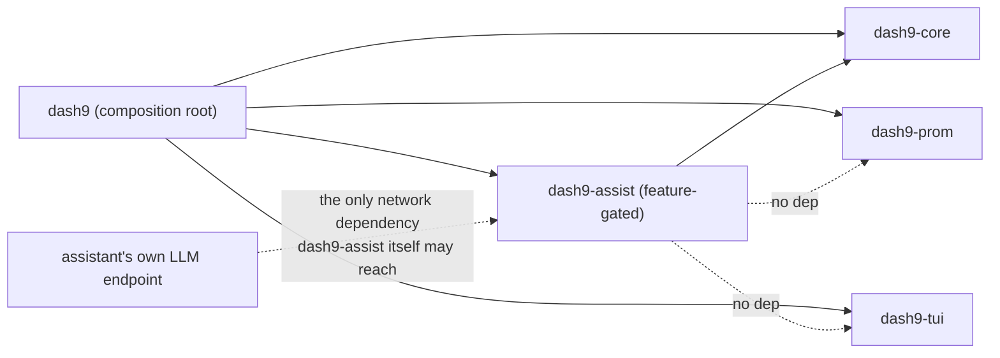

# dash9-assist — docs/specs/assist.md

`dash9-assist` is an optional AI assistant for dash9. It has exactly
one effector: it emits dash9 command-grammar text (SPEC.md Section
B), which is validated and executed through the exact same path a
human's keystrokes go through. If a capability cannot be expressed as
a command, the assistant does not have that capability — there is no
second, richer API it can fall back to.

This document is the single source of truth for Phase 2 (assist v1).
Prerequisites (all merged): `SPEC.md`, the `dash9-core` command
grammar with its stable error codes, `dash9-prom`, the TUI +
`dash9-tui` rendering foundation, and `dash9 demo`. No implementation
code is written until this document is reviewed and approved — see
`SPEC.md`'s own front matter for the same rule applied to Phase 1.

## Contents

- [A. Scope, prerequisites, non-goals](#a-scope-prerequisites-non-goals)
- [B. Crate and feature boundaries](#b-crate-and-feature-boundaries)
- [C. dash9-core additions](#c-dash9-core-additions)
- [D. The LLM client](#d-the-llm-client)
- [E. Context assembly](#e-context-assembly)
- [F. The system prompt](#f-the-system-prompt)
- [G. The contract loop](#g-the-contract-loop)
- [H. Verb classification: blast radius and execution policy](#h-verb-classification-blast-radius-and-execution-policy)
- [I. Session log and audit trail](#i-session-log-and-audit-trail)
- [J. Failure handling](#j-failure-handling)
- [K. Demo mode and test infrastructure](#k-demo-mode-and-test-infrastructure)
- [L. Status and observability](#l-status-and-observability)
- [M. Worked example](#m-worked-example)
- [N. Non-goals for v1](#n-non-goals-for-v1)

---

## A. Scope, prerequisites, non-goals

This spec covers the `dash9-assist` crate — the LLM client, prompt
and context assembly, the validate/repair contract loop, the verb
classification policy — and its integration into `dash9 demo
--assist`. It does **not** cover the interactive session's own
keybindings, meta-commands, or status bar (`docs/specs/open.md`), only
what the assistant itself does once wired in: `open`'s `a` key toggles
the assistant on/off (there is no separate `:ask` keybinding — a
command-bar line with no leading `/` is unconditionally natural
language and reaches the assistant whenever it's on,
`docs/specs/open.md` Section C), and `y`/`n` accept or dismiss a
pending proposal (`docs/specs/open.md` Section E). The contract loop
itself is fully exercisable today via `dash9 demo --assist` and its
fixture-replay test (Section K).

Non-goals for v1 are listed in full in Section N; the short version:
no streaming, no multi-turn tool use, the assistant never reads query
*results* (it proposes queries; it does not interpret `Frame`s — see
`:ask --with-results` reserved for v2), no embeddings, no
vendor-specific API beyond OpenAI-compatible `/v1/chat/completions`.

## B. Crate and feature boundaries

A new workspace member, `dash9-assist`, sits beside the existing
crates:



- `dash9-assist` depends on `dash9-core` (for `Command`, `parse`,
  `ErrorCode`, `CommandError`, and the new verb-reference/path-check
  additions in Section C) plus its own transport dependencies
  (`reqwest`, `serde`, `serde_json`, `thiserror`, `tokio`). It does
  **not** depend on `dash9-prom` or `dash9-tui`.
- `dash9-core` gains **zero new crate dependencies** from this work
  — only new pure-data types and functions (Section C).
- The `dash9` binary gets a new Cargo feature, `assist` (`dash9-assist
  = { workspace = true, optional = true }`, `assist =
  ["dep:dash9-assist"]`), included in `default = ["assist"]` so a
  normal `cargo build --release` ships it, while `cargo build
  --no-default-features` (and a CI job running it) proves
  `dash9-core`/`dash9-tui`/`dash9-prom` and the rest of the binary
  compile and fully function without it. `dash9 test`, `dash9 open`,
  and `dash9 demo` (without `--assist`) must not reference
  `dash9-assist` at all when the feature is off — `#[cfg(feature =
  "assist")]` gates the `demo --assist` flag, `open --assist`'s `a`
  key/`y`/`n`/`/ai`/`/model` wiring (`docs/specs/open.md`), and
  nothing else.

**Why `dash9-assist` cannot fetch its own datasource metadata:**
constraint 2 (see the task that produced this spec) says the
assistant's only network dependency is its own LLM endpoint. Fetching
Prometheus metric names / label keys is therefore the composition
root's job (via `dash9-prom`, already-established code paths), which
hands `dash9-assist` an already-fetched, already-cached
`AssistContext` value (Section E) each time `ask()` is called.
`dash9-assist` only ever turns data it's given into prompt text — it
never reaches for a `Datasource` itself.

## C. dash9-core additions

Three small, additive changes. All are plain data/functions; none add
a crate dependency.

### C.1 Machine-readable verb reference (drift guard)

The system prompt's command reference (Section F) must be generated
from the parser's own verb definitions, never a hand-maintained copy
that can drift out of sync with `command.rs`. Full macro-driven
generation from the tokenizer's control flow is unnecessary
complexity for what's actually a small, append-only verb table
(SPEC.md B.1); instead, `command.rs` gains a small static table
colocated with `parse()`, plus a test that makes drift impossible to
introduce silently:

```rust
/// One entry per verb `dash9-assist`'s prompt may reference. Colocated
/// with `parse()` so a verb addition and its reference-table entry
/// land in the same review; `command_reference_matches_parser` (a
/// dash9-core test) fails if they ever diverge.
pub struct VerbSpec {
    pub verb: &'static str,
    pub args: &'static [&'static str],
    pub example: &'static str,
    pub description: &'static str,
}

/// Excludes `quit` deliberately — see Section H: session-control
/// verbs are never something the assistant should propose, so they
/// are not part of its vocabulary at all, not merely blocked at
/// validation time.
pub const VERB_REFERENCE: &[VerbSpec] = &[ /* ds add, ds list, q,
    panel type, panel threshold, panel title, range, refresh,
    dash save, dash open — one entry each, mirroring SPEC.md B.3 */ ];
```

The drift-guard test parses each entry's `example` via `parse()` and
asserts it succeeds, and separately asserts every `Command` variant
`parse()` can produce (other than `Quit`) has a corresponding
`VERB_REFERENCE` entry — so adding a verb to the parser without
updating the table (or vice versa) fails CI immediately.

### C.2 Workspace-relative path enforcement (new `E107`)

Today, nothing stops `dash save`/`dash open` from resolving outside
the workspace root — `parse()` accepts any string as the path
argument, and only I/O-time failures (missing file, unwritable path)
are checked. That gap is fine for a trusted human typing at a
terminal; it is not acceptable once a less-trusted origin (an LLM)
can propose the same command. Rather than special-case the
assistant, this spec closes the gap for every command source, human
or assistant:

```rust
/// New, append-only per SPEC.md B.1/B.5 — does not change any
/// existing code's meaning.
pub enum ErrorCode {
    // ... E001-E106 unchanged ...
    /// `dash save` / `dash open` path resolves outside the workspace
    /// root (absolute path, `..` traversal, or a symlink escape).
    E107,
}

/// Rejects a `dash save`/`dash open` path that would resolve outside
/// `workspace_root`. Used by every command source, not assist-specific.
pub fn validate_workspace_relative_path(
    workspace_root: &std::path::Path,
    candidate: &str,
) -> Result<std::path::PathBuf, CommandError>;
```

`SPEC.md` Section B.5's error table gains one appended row (`E107`);
no existing row changes.

### C.3 Session log types

Section I needs every assistant-originated command to land in "the
session log ... exactly like user commands," but at the time this was
written no session log existed yet (`dash9 open`'s interactive session
wasn't built — it since has been, and does use this type; see
`docs/specs/open.md` Section F). Rather than let assist invent its own
log shape now and reconcile it with `open`'s later, both key off one
small, shared type added now:

```rust
#[derive(Debug, Clone, PartialEq, Eq)]
pub enum CommandSource {
    User,
    Assistant,
}

#[derive(Debug, Clone, PartialEq)]
pub struct SessionLogEntry {
    pub source: CommandSource,
    pub command_text: String,
    pub timestamp_ms: i64,
}
```

`dash9-core` does not own a live, growing log (that's session state,
owned by whatever runs the interactive loop — `open` today, `demo
--assist` for this phase); it only owns the shared entry shape so
both producers agree on it from day one.

## D. The LLM client

One OpenAI-compatible code path (`POST {base_url}/v1/chat/completions`)
serves Ollama, vLLM, LM Studio, and on-prem gateways — no
vendor-specific branches, no SDK dependency (hand-rolled `reqwest`,
matching `dash9-prom`'s existing pattern).

```rust
pub struct AssistConfig {
    pub base_url: String,
    pub model: String,
    /// Name of an environment variable holding the API key, e.g.
    /// `"OPENAI_API_KEY"`. The literal key value is never read from
    /// or written to a dashboard file or this config file.
    pub api_key_env: Option<String>,
    pub timeout_ms: u64,
    pub max_tokens: u32,
    /// Reserved for v2. Loading a config with `stream = true` is a
    /// config-validation error in v1, not a silently-ignored no-op.
    pub stream: bool,
}
```

**Where this config lives:** a dedicated file (default
`~/.config/dash9/assist.toml`, overridable with `--assist-config
<path>`), never the dashboard TOML — dashboard files are meant to be
shared/committed (SPEC.md's dashboard schema), and an LLM endpoint
config (let alone an API key reference) does not belong in a file
whose whole purpose is to be checked into a team's repo.

**Request:** standard `{"model", "messages": [{"role","content"},
...], "max_tokens"}` body. No `temperature` knob in v1 — one fewer
config surface than asked for, added later only if a concrete need
shows up. **Response:** no streaming; read the whole body, parse
`choices[0].message.content` as the reply text. Anything else
(`choices` empty, non-JSON body, non-2xx status, connect/timeout
error) is an `AssistError` (Section J), not a partial success.

The client also opportunistically parses the response's `usage`
object (`{"prompt_tokens", "completion_tokens", "total_tokens"}`,
standard in the OpenAI-compatible shape) into a `TokenUsage`. Not
every compatible server populates it reliably, so this is `Option`,
never assumed present:

```rust
#[derive(Debug, Clone, Copy, Default)]
pub struct TokenUsage {
    pub prompt_tokens: u32,
    pub completion_tokens: u32,
    pub total_tokens: u32,
}
```

Section L covers how this is accumulated and surfaced across a
session, including the easy-to-miss detail that a repair turn
(Section G) is a real additional API call and must be counted too.

## E. Context assembly

Every `ask()` call assembles:

| Element | Source | Always included in full, or budget-constrained? |
|---|---|---|
| Active datasources (name + type) | Composition root's loaded `ValidatedDashboard` | Always in full (tiny) |
| Current time range | Composition root's session/view state | Always in full (tiny) |
| Metric names for the active datasource | `dash9-prom`'s metadata endpoints, fetched **by the composition root**, cached with a 5-minute TTL keyed by datasource name | Budget-constrained, priority 1 |
| Label keys for the active datasource | Same as above | Budget-constrained, priority 2 |
| Current dashboard TOML (if one is open) | Composition root | Budget-constrained, priority 3 |

`dash9-assist` never owns the TTL cache or performs the fetch — see
Section B. It receives an already-assembled `AssistContext`:

```rust
pub struct AssistContext {
    pub datasources: Vec<DatasourceSummary>,
    pub active_datasource_metadata: Option<ActiveDatasourceMetadata>,
    pub dashboard_toml: Option<String>,
    pub time_range: TimeRangeSummary,
}

pub struct DatasourceSummary { pub name: String, pub datasource_type: String }
pub struct ActiveDatasourceMetadata {
    pub datasource_name: String,
    /// Alphabetically sorted; deterministic truncation point.
    pub metric_names: Vec<String>,
    pub label_keys: Vec<String>,
}
pub struct TimeRangeSummary { pub start_ms: i64, pub end_ms: i64 }
```

**Fetching metric names / label keys** requires two new
`Datasource`-adjacent capabilities that don't exist yet
(Prometheus's `/api/v1/label/__name__/values` and `/api/v1/labels`).
These are added to the `Datasource` trait in `dash9-core` (two more
async methods, same shape as `query`/`query_range`) and implemented
in `dash9-prom` exactly like the existing two — this is the one place
this spec touches `dash9-prom`, and it's additive, not a redesign.

**Token budget:** 2000 tokens for the budget-constrained section of
the prompt (metric names, label keys, dashboard TOML combined),
estimated with `text.len() / 4` — the standard rough
characters-per-token heuristic for English/code. This is an
approximation, not an exact tokenizer count (no `tiktoken`-class
dependency, matching "hand-rolled, no heavyweight SDK"); it exists to
keep the prompt from silently growing unbounded, not to hit an exact
model context limit. 2000 tokens comfortably fits inside the smallest
context windows the supported local runtimes (Ollama, LM Studio)
default to, leaving headroom for the system prompt, conversation
history, and `max_tokens` of response.

**Truncation priority (pinned, matches the task's requirement
exactly):** metric names > label keys > dashboard TOML. Fill the
budget in that order — spend on metric names first, then whatever's
left on label keys, then whatever's left on the dashboard TOML text
(which may end up entirely omitted). When a list is truncated, it
carries a trailing marker (`"(+N more not shown)"`) rather than
silently looking complete — the model must not infer a metric doesn't
exist just because the truncated list didn't happen to include it.

## F. The system prompt

The exact template (verb reference generated from `VERB_REFERENCE`,
Section C.1; everything in `{braces}` is substituted per-call):

```
You are the dash9 assistant. You have exactly one capability: emitting
dash9 commands. You cannot run shell commands, read or write files
directly, or do anything except emit commands from the reference
below. If a request cannot be expressed as one or more of these
commands, say so in one sentence and emit no command block at all.

Command reference:
{one line per VERB_REFERENCE entry: "{verb} {args} — {description}. Example: {example}"}

Output format (follow exactly):
- Optionally, one sentence describing your intent.
- Then, if and only if you are proposing commands, exactly one
  fenced code block containing one command per line and nothing else
  — no comments, no blank lines, no prose inside the block.
- If you cannot express the request as commands, reply with one
  sentence and no fenced code block. That is a complete, valid reply.

Context:
Datasources: {datasources, always in full}
Active datasource metadata: {metric names, label keys — see truncation rules}
Current dashboard: {dashboard TOML, or "none open"}
Current time range: {start} to {end}
```

**Contract, precisely:** a reply is *either* (a) an optional one
sentence plus exactly one fenced block whose every line parses via
`dash9_core::parse()`, *or* (b) one sentence and no fenced block at
all (a refusal/clarification, not a contract violation). A contract
violation is: a fenced block present but containing a line that fails
`parse()`, more than one fenced block, text after the fenced block,
or non-command content inside it.

## G. The contract loop

`ask()` is a method on `AssistSession` (Section L), not a bare
function — something has to hold conversation history, the running
token total, and the on/off toggle across calls, and that something
is the session, not the caller.

1. Build the prompt (Sections E, F) from `AssistContext` plus this
   session's prior turns, which `AssistSession` maintains internally.
2. Send it via the LLM client (Section D).
3. Parse the reply per the contract (Section F). If it's a refusal
   (no fenced block), return `AssistOutcome::Refusal(sentence)` —
   done, no validation/repair needed.
4. If a fenced block is present, validate **every line** two ways,
   in order:
   1. Syntactic: `dash9_core::parse(line)`. Catches `E001`-`E006`.
   2. Semantic, against current session state: does a referenced
      datasource exist (`E101`), is a panel focused if a `panel *`
      verb was used (`E103`), does a `dash save`/`dash open` path
      stay inside the workspace (`E107`, Section C.2). **A datasource
      that doesn't exist is not a special case** — it is `E101`, the
      same code and message a human's malformed command produces
      (this is the exact case the task called out to pin: the
      validator catches it, uninstrumented).
5. First failing line wins (in file order) if a line fails; report
   only that one. On failure, send a repair turn: a new `user`-role
   message appended to the *same* conversation (the model's original
   full reply is already in history, so it doesn't need to be
   re-pasted):
   ```
   Command on line {n} failed to parse: `{line}`
   Parser error {code}: {message}
   Reply again with the complete corrected command block (same format as before).
   ```
6. Re-run from step 4 on the new reply. **Maximum 2 repair turns**
   (3 attempts total). If attempt 3 still fails, return
   `AssistOutcome::Failed(AssistError::ContractViolationAfterRepairs
   { attempts: 3, last_reply, last_error })` — surfaced to the user
   verbatim (Section J), never retried further, never executed
   anyway.
7. On success, classify every parsed `Command` (Section H) into
   `ProposedCommand::AutoRun` or `ProposedCommand::Proposal`, and
   return `AssistOutcome::Turn(AssistTurn { intent_sentence, commands,
   raw_reply })`.

Every attempt in steps 2-6 (the original call, and up to two repair
calls) is a real HTTP request against the LLM endpoint, and each has
its own `usage`. `AssistSession::ask()` sums all of them into one
`TokenUsage` for the turn — a repair round-trip is not free just
because the user never sees the failed intermediate reply.

```rust
pub enum ProposedCommand {
    AutoRun(dash9_core::Command),
    Proposal(dash9_core::Command),
}

pub struct AssistTurn {
    pub intent_sentence: Option<String>,
    pub commands: Vec<ProposedCommand>,
    pub raw_reply: String,
    /// Summed across every attempt this turn made, including repairs.
    pub usage: Option<TokenUsage>,
}

pub enum AssistOutcome {
    Turn(AssistTurn),
    Refusal(String),
    Failed(AssistError),
}

impl AssistSession {
    pub fn new(config: AssistConfig) -> Self;

    /// If the session is disabled (Section L), returns
    /// `AssistOutcome::Refusal` immediately and makes no network call.
    pub async fn ask(&mut self, context: &AssistContext, request: &str) -> AssistOutcome;
}
```

## H. Verb classification: blast radius and execution policy

Every verb in SPEC.md B.3 is classified below. This table is the
canonical public reference for the classification (per the task's
requirement that it "also goes in the public docs") — nothing about
it is assist-internal.

| Verb | Blast radius | Execution |
|---|---|---|
| `ds list` | read-only (pure enumeration) | auto-run, renders immediately |
| `q` | read-only (executes a query, no state mutation) | auto-run |
| `range` | read-only (current-session view only, no external/persistent effect) | auto-run |
| `panel type` | read-only (current-session view only) | auto-run |
| `panel threshold` | read-only (current-session view only) | auto-run |
| `panel title` | read-only (current-session view only) | auto-run |
| `ds add` | state-changing (adds a new network endpoint to the session's trust surface) | proposal — single keypress to apply |
| `refresh` | state-changing (alters background polling cadence) | proposal |
| `dash save` | state-changing (writes to disk) | proposal |
| `dash open` | state-changing (replaces the entire active dashboard context) | proposal |
| `quit` | excluded | never in the assistant's vocabulary — omitted from `VERB_REFERENCE` entirely (Section C.1), not merely blocked at validation |

**Read-only vs. state-changing, the actual principle:** a verb is
read-only if its only effect is the current interactive view
(reversible by re-issuing another view command, touches no external
system, persists nothing). A verb is state-changing if it persists to
disk, opens a new network endpoint, or changes unattended background
behavior. This is why `range`/`panel *` are auto-run despite mutating
in-memory session state — the state they mutate is exactly the thing
being viewed, with no effect once the session ends — while `ds add`
(new network target), `refresh` (background scheduling), and `dash
save`/`dash open` (disk, whole-dashboard context swap) require an
explicit keypress.

**Note on scope drift:** an earlier description of this policy
mentioned `panel preview` as a read-only example verb. That verb does
not exist in the current grammar (SPEC.md B.3) — this spec does not
invent it. If a future SPEC revision adds it, it is read-only by the
same principle above; until then it is simply not part of the
assistant's (or anyone's) vocabulary.

**Blocklist, enforced in the validator, not the prompt:** `quit`
(excluded from the vocabulary, not merely rejected) and any `dash
save`/`dash open` path that fails `validate_workspace_relative_path`
(`E107`, Section C.2). There is no shell-executing verb in dash9's
grammar today; if one is ever added, it is excluded from
`VERB_REFERENCE` the same way `quit` is, as a standing rule for future
verb additions.

## I. Session log and audit trail

Every command the assistant's turn produces — whether auto-run or
staged as a proposal, whether ultimately applied or not — is wrapped
in a `SessionLogEntry { source: CommandSource::Assistant, ... }`
(Section C.3) alongside whatever a human's typed command produces
(`CommandSource::User`). There is no invisible assistant action: a
proposal the user never applies still appears in the log as a
proposal, not as if it never happened.

The live, growing log itself (the thing rendered on screen, persisted
across a session) is owned by whichever surface is running — today,
that's `dash9 demo --assist`'s in-memory log (Section K); once `dash9
open` exists, it owns the real interactive session's log. Both key
off the same `SessionLogEntry` shape, so nothing about the log format
needs to change when `open` lands.

## J. Failure handling

Endpoint unreachable, timeout, non-JSON reply, or a contract violation
that survives 2 repair turns: show the actual `AssistError` in the
assist pane (or, in demo mode, the log panel), verbatim. Specifically:

- Never silently retry beyond the 2-repair budget.
- Never fabricate a result or a plausible-looking command when the
  LLM call fails outright.
- Never fall back to executing a guessed command in place of a failed
  contract — a failure is shown as a failure, not papered over.

```rust
pub enum AssistError {
    EndpointUnreachable(String),
    Timeout,
    NonJsonResponse(String),
    EmptyResponse,
    ContractViolationAfterRepairs {
        attempts: u8,
        last_reply: String,
        last_error: dash9_core::CommandError,
    },
}
```

## K. Demo mode and test infrastructure

`dash9 demo --assist` (feature-gated, only compiled with `--features
assist`) runs the same synthetic timeseries panel as `dash9 demo`,
with a log panel alongside it showing the session log (Section I) and
a one-line status readout (`AssistStatusModel::render_text()`, Section
L) as plain text (a deterministic, Ratatui-light `Paragraph`
rendering, consistent with the existing text-fallback pattern in
`dash9-tui::chart`, not a new rendering mechanism).

Instead of `HttpLlmClient`, `demo --assist` wires a fixture-backed
client that returns a canned reply for a known request string (exact
match) and a clear "no fixture for this input" message otherwise —
real keystrokes, the real contract/validate/execute path, zero
network. Fixtures live in `crates/dash9-assist/fixtures/demo.json`:
an array of `{ "request": "...", "reply": "..." }` pairs, each
`reply` a literal LLM-shaped response (intent sentence + fenced
block) that must already satisfy the contract with zero repairs —
these are curated, reviewed examples, not live model output.

This is what the launch GIF shows: a question typed into the assist
pane → the status line ticks from `idle` to `waiting` and the canned
commands appear in the log, marked assistant-originated → the
auto-run ones execute, the chart updates, and the status line settles
back to `idle` with the token count incremented.

**Integration test** (`crates/dash9-assist/tests/fixtures_replay.rs`):
iterates every fixture, feeds its `reply` through the real contract
parser and `dash9_core::parse()`/semantic validation (Section G steps
4-5), and asserts zero repair turns are needed and every command
classifies correctly (Section H). A fixture that fails this test is a
bug in the fixture, caught in CI before it ever reaches a recording.

## L. Status and observability

The user needs to see, at a glance: which model/endpoint is
configured, whether the assistant is on or off, whether the last call
succeeded, and how many tokens a session has burned. All of this is
plain data owned by `AssistSession`, exposed through one method — no
network or terminal access needed to read it:

```rust
pub enum ConnectivityState {
    /// Toggled off; `ask()` will not make a network call.
    Disabled,
    /// Enabled, nothing in flight; last call (if any) succeeded.
    Idle,
    /// A request is currently in flight.
    Waiting,
    /// The last call failed; a short, human-readable summary of why.
    Error(String),
}

pub struct AssistStatusModel {
    pub model: String,
    /// Host only (e.g. "localhost:11434"), never the full URL with
    /// any embedded query string — kept short for a status line, and
    /// there is never a key in it (Section D: the key is an env-var
    /// reference, never part of `base_url`).
    pub endpoint_host: String,
    pub connectivity: ConnectivityState,
    /// From the most recently completed turn, including its repairs.
    pub last_turn_usage: Option<TokenUsage>,
    /// Cumulative across every turn this session. Stays at zero,
    /// never estimated, if the endpoint never reports `usage`.
    pub session_total_usage: TokenUsage,
}

impl AssistStatusModel {
    /// Deterministic, no terminal dependency — same pattern as
    /// `ChartModel::render_text()` (`docs/architecture/rendering.md`).
    /// e.g. `"gpt-4o-mini @ localhost:11434 — idle — 1,204 tokens this session"`.
    pub fn render_text(&self) -> String;
}
```

**On/off is a runtime toggle, distinct from the `assist` Cargo
feature** (Section B): the feature controls whether the code is
compiled in at all; `AssistSession`'s enabled/disabled state controls
whether *this session* currently calls out to the LLM. Toggling it off
sets `connectivity` to `Disabled` and makes `ask()` a no-op
(`AssistOutcome::Refusal`, no request sent) rather than merely hiding
the UI — flip it back on and the model/endpoint from the original
`AssistConfig` resume unchanged. **There is no runtime model or
endpoint switching in v1** — changing either means restarting with a
different config file, not a verb or a keybinding (this is also
recorded in Section N's non-goals).

**Showing `Waiting` live, while the terminal keeps redrawing during an
in-flight call,** is not something `dash9-assist` can do on its own —
an `&mut self` async method has no way to notify a caller mid-await.
This mirrors a problem `dash9` already solved for scheduled panel
refreshes (`docs/architecture/rendering.md`'s divergence notes: "Refresh
tasks live in the binary/runtime layer and deliver Frames over a
channel; the TUI only ever receives completed projections"). The same
shape applies here: the composition root runs `ask()` as a background
task and sets a shared "waiting" flag (or sends a status update over
the same kind of channel) the instant it starts the call, clearing it
when `ask()` returns — `dash9-assist` itself only ever produces the
before/after `AssistStatusModel` snapshots, never a live subscription.

## M. Worked example

Request: `"show me cpu load over the last hour"` (dashboard has one
Prometheus datasource named `prom`, no dashboard TOML open, time range
already 1h).

LLM reply (first attempt):
~~~
I'll chart 1-minute load average over the last hour.
```
q node_load1
range 1h
```
~~~

Both lines parse (`Command::Q`, `Command::Range`) and pass semantic
validation (no datasource reference to check for `q`'s raw-tail
query; `range` has no datasource at all). Both are read-only
(Section H) → both auto-run. `AssistOutcome::Turn` carries
`intent_sentence: Some("I'll chart 1-minute load average over the
last hour.")` and two `ProposedCommand::AutoRun` entries. Two
`SessionLogEntry { source: Assistant, .. }` rows are appended, the
query executes, the chart updates — no keypress required beyond
having asked the question.

Contrast with a state-changing request, `"save this as
examples/load.toml"`:
~~~
```
dash save examples/load.toml
```
~~~
This parses, and `validate_workspace_relative_path` accepts
`examples/load.toml` (inside the workspace). It classifies as a
proposal (Section H) — it appears in the log as a pending
assistant-originated proposal and waits for the user's single
keypress before anything is written to disk.

## N. Non-goals for v1

Explicitly out of scope, so they are not accidentally implemented
during this phase:

- **No streaming.** `AssistConfig.stream` is reserved and must be
  `false`; setting it `true` is a config-load error, not a silent
  fallback to non-streaming.
- **No multi-turn tool use / function calling.** The contract is
  plain-text commands in, plain-text commands out — no tool-call
  JSON schema, no agentic loop beyond the 2-repair budget.
- **The assistant never reads query results.** It proposes commands;
  it does not see the `Frame` a query returns and cannot reason about
  the data. Reserved for v2 as `:ask --with-results`, a distinct,
  explicitly-opted-into mode.
- **No embeddings**, no semantic search over metric names — the
  metric-name list handed to the model is the literal (truncated)
  list from Section E, nothing vector-indexed.
- **No vendor-specific API.** OpenAI-compatible
  `/v1/chat/completions` only; no Anthropic Messages API, no Gemini,
  no bespoke Ollama-native endpoint, even though Ollama also exposes
  one.
- **No autonomous action beyond the repair budget.** Two repairs,
  then a shown failure — never an unbounded retry loop, never a
  fallback execution path.
- **No runtime model or endpoint switching.** `AssistConfig`'s model
  and `base_url` are fixed for an `AssistSession`'s lifetime (Section
  L); changing either means restarting with a different config file,
  not a command the assistant or the user issues mid-session.
